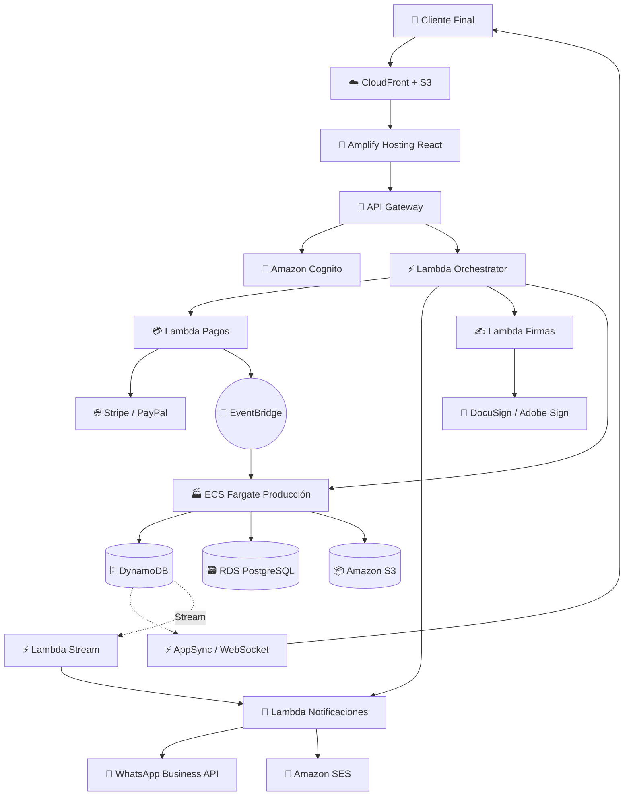
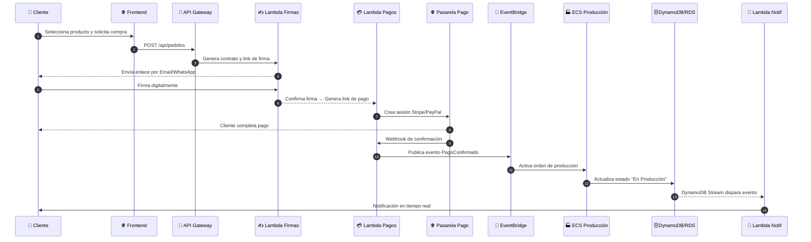
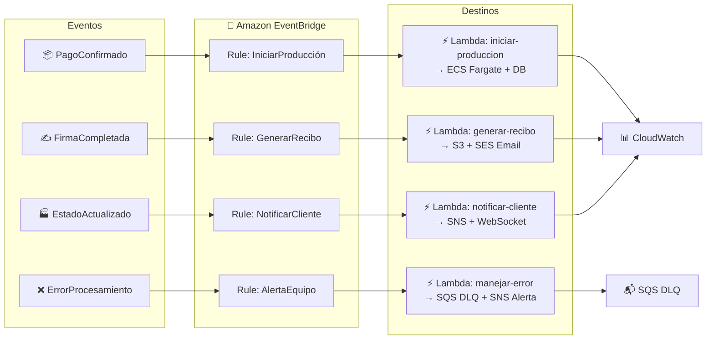

# 📘 PROYECTO CICOR: Documentación de Arquitectura en la Nube (AWS)
## Sistema de Gestión de Pedidos, Firma Digital y Trazabilidad de Producción

---

## 1. Define el propósito del sistema

### ¿Qué problema resuelve?
Actualmente, la venta y producción de productos personalizados (ej. baldosas) se gestiona mediante procesos manuales, hojas de cálculo y canales de comunicación dispersos. Esto genera:
- **Duplicidad y pérdida de información** entre áreas comerciales y operativas.
- **Baja trazabilidad** del estado de producción para el cliente final.
- **Retrasos en la activación** de la línea de producción tras la confirmación de pago.
- **Notificaciones inconsistentes o manuales** (WhatsApp, email, llamadas).
- **Firmas y pagos en plataformas independientes**, sin registro unificado ni validez legal centralizada.

**CICOR** busca centralizar y automatizar el ciclo completo: `cotización → firma digital → pago → activación de producción → seguimiento en tiempo real → notificaciones automáticas`, eliminando cuellos de botella, reduciendo errores humanos y brindando transparencia operativa.

### ¿Quiénes son los usuarios o consumidores del sistema?
| Rol | Responsabilidad principal | Frecuencia de uso |
|-----|--------------------------|-------------------|
| **Cliente Final** | Selecciona producto, firma digital, paga y monitorea su pedido | Esporádico (por compra) |
| **Área Comercial** | Genera cotizaciones, valida datos del cliente y activa flujo de venta | Diario |
| **Área de Producción** | Recibe órdenes, actualiza avances (%), reporta incidencias | Diario |
| **Contabilidad** | Recibe confirmaciones de pago, emite recibos, concilia transacciones | Semanal |
| **Administrador** | Gestiona roles, catálogo, parámetros del sistema y métricas | Ocasional |

> 💡 *Nota para el equipo: Validar si se requiere integración con área de Logística/Despacho en una fase posterior.*

### ¿Cuáles son los objetivos funcionales principales?
- ✅ Permitir compra con firma digital vinculada al contrato/pedido.
- ✅ Enviar notificaciones automáticas por WhatsApp y Email en hitos clave.
- ✅ Actualizar en tiempo real el estado de producción visible al cliente.
- ✅ Integrar pasarelas de pago con confirmación automática vía webhooks.
- ✅ Desencadenar flujo de producción inmediatamente tras confirmar el pago.
- ✅ Almacenar documentos legales y comprobantes con cifrado y versionado.
- ✅ Proveer dashboard de seguimiento para cliente y áreas internas.

---

## 2. Delimita el alcance del proyecto

### ¿Qué funcionalidades incluirás en esta versión inicial?
- Autenticación y gestión de perfiles con **Amazon Cognito**.
- Catálogo básico de productos con disponibilidad y precios.
- Flujo de compra: `selección → generación de contrato → firma digital → link de pago`.
- Integración con **WhatsApp Business API** y **Amazon SES** para email.
- Portal seguro de firma (S3 + Lambda + API externa tipo DocuSign/Adobe Sign).
- Procesamiento de pagos (Stripe/PayPal vía Lambda + escucha de webhooks).
- Panel web para que producción actualice estados (% avance, observaciones).
- Notificaciones automáticas por cambio de estado (SNS + EventBridge).
- Dashboard cliente con actualizaciones en tiempo real (AppSync / WebSocket).
- Envío automático de recibo por email/WhatsApp tras confirmación de pago.

### ¿Qué módulos o componentes formarán parte?
| MVP | Descripción | Entorno / Tecnología |
|-----|-------------|----------------------|
| **MVP 1** | Desarrollo y pruebas locales | Docker Compose, AWS SAM/CDK Local, DynamoDB Local |
| **MVP 2** | Despliegue en AWS (Serverless + Contenedor) | ECR, ECS Fargate, API Gateway, Lambda, RDS/DynamoDB, S3 |
| **MVP 3** | Producción, CI/CD y monitoreo | CodePipeline/GitHub Actions, CloudWatch, X-Ray, WAF, IAM |

> ⚠️ *Si el curso exige Kubernetes, puede migrarse `cicor-produccion` a Amazon EKS en MVP 3. Para este caso de uso, ECS Fargate + Serverless es más costo-eficiente y se alinea con AWS Well-Architected.*

### ¿Qué elementos se dejarán fuera del alcance (por ahora)?
- App móvil nativa (iOS/Android).
- Integración con ERP contable externo o facturación electrónica (DIAN/SIAT).
- Módulo de logística y tracking físico de envíos.
- Chatbot con IA o atención automatizada.
- Reportes analíticos avanzados (QuickSight) o modelos predictivos.
- Multi-idioma y multi-moneda.

---

## 3. Identifica los contenedores o servicios

### ¿Qué componentes se desplegarán como contenedores?
| Componente | Tipo de Despliegue | Justificación |
|------------|-------------------|---------------|
| `cicor-produccion` | ECS Fargate (Docker) | Servicio con estado, requiere conexión persistente a DB y ejecución continua |
| `cicor-lambdas` | Serverless (Lambda) | Escalabilidad automática, ejecución por evento, ideal para orquestación |
| `cicor-worker-notificaciones` | Lambda (o contenedor ligero) | Procesamiento asíncrono de mensajes masivos |
| `cicor-ui` | S3 + CloudFront / Amplify | Frontend estático, sin necesidad de contenedor |

### ¿Qué lenguaje o tecnología usarás en cada uno?
| Componente | Lenguaje/Framework | Base/Runtime |
|------------|-------------------|--------------|
| `cicor-produccion` | Node.js + Express.js + TypeORM | Docker `node:20-alpine` |
| `cicor-orchestrator` | TypeScript + AWS SDK v3 + Middy | Node.js 20.x |
| `cicor-notificaciones` | Python + `boto3` + `requests` | Python 3.11 |
| `cicor-pagos` | Node.js + Stripe/PayPal SDK | Node.js 20.x |
| `cicor-ui` | React 18 + TypeScript + Amplify UI | SPA estático |
| `cicor-db` | DynamoDB (NoSQL) + RDS PostgreSQL | Managed AWS |

### ¿Qué tareas realiza cada uno?
- `cicor-produccion`: Expone API REST para actualizar estados, valida permisos, escribe en DB, publica eventos a EventBridge.
- `cicor-orchestrator`: Valida JWT de Cognito, enruta peticiones, maneja errores y retorna respuestas estandarizadas.
- `cicor-notificaciones`: Formatea mensajes por canal, invoca WhatsApp API/SES, registra intentos y reintentos en DynamoDB.
- `cicor-pagos`: Crea sesiones de pago, escucha webhooks de confirmación, actualiza estado del pedido y dispara evento `PagoConfirmado`.
- `cicor-ui`: Renderiza catálogo, formulario de firma, dashboard de seguimiento y consume WebSocket/AppSync para tiempo real.

---

## 4. Define cómo se comunican los contenedores

### ¿Qué servicios se comunican entre sí?
- `Frontend ↔ API Gateway ↔ Lambda Orchestrator`
- `Lambda Pagos ↔ Stripe/PayPal API` (webhook de confirmación)
- `Lambda Notificaciones ↔ WhatsApp Business API + Amazon SES`
- `ECS Producción ↔ DynamoDB / RDS`
- `EventBridge ↔ Lambda` (disparadores asíncronos entre módulos)
- `DynamoDB Streams ↔ Lambda` (actualizaciones en tiempo real hacia cliente)

### ¿Qué protocolos usarás (HTTP, TCP, etc.)?
| Comunicación | Protocolo | Puerto | Justificación |
|--------------|-----------|--------|---------------|
| Cliente ↔ API Gateway | HTTPS (TLS 1.3) | 443 | Estándar web, cifrado en tránsito, compatible con WAF |
| Lambda ↔ DynamoDB/S3 | HTTPS (AWS SDK) | 443 | Conexión gestionada, firma automática de requests |
| ECS ↔ RDS | TCP + SSL/TLS | 5432 | Conexión persistente con cifrado de base de datos |
| Real-time ↔ Cliente | WSS (WebSocket Secure) | 443 | Baja latencia para push notifications y dashboards |
| Webhooks externos | HTTPS | 443 | Compatibilidad nativa con pasarelas de pago y APIs |

> 🔍 *Reflexión académica: ¿Por qué no usar gRPC o TCP plano en el MVP?*  
> HTTP/HTTPS y WebSockets son suficientes para este flujo, reducen complejidad de implementación, son nativamente compatibles con API Gateway y servicios serverless, y facilitan la integración con APIs externas de terceros.

---

## 5. Diseña la arquitectura general

### 🖼️ Diagrama de Arquitectura de Alto Nivel (AWS)

**Descripción**: *Figura 1. Arquitectura de alto nivel del sistema CICOR en AWS. El cliente interactúa con el frontend alojado en Amplify/CloudFront, el cual se comunica vía API Gateway. La capa de negocio está desacoplada en funciones Lambda (orquestación, pagos, notificaciones, firmas) y un contenedor ECS para producción. Los datos persisten en DynamoDB, RDS y S3. EventBridge orquesta los flujos asíncronos y AppSync/WebSocket habilitan las actualizaciones en tiempo real.*

---

## 6. Selecciona los servicios de nube (si aplica)

### ¿En qué entorno correrá tu solución?
- **Desarrollo**: Docker Compose + AWS SAM/CDK Local
- **Pruebas/Producción**: AWS Serverless + ECS Fargate + Managed Databases
- **Despliegue**: GitHub Actions / AWS CodePipeline + AWS CDK (Infraestructura como Código)

### ¿Utilizarás servicios de nube como S3, RDS, ECR, etc.?
| Servicio AWS | Uso en CICOR |
|--------------|--------------|
| `ECR` | Repositorio privado de imágenes Docker para `cicor-produccion` |
| `ECS Fargate` | Orquestación del servicio de producción sin gestionar servidores |
| `S3` | Almacenamiento de contratos firmados, recibos, imágenes de productos |
| `IAM` | Roles de mínimo privilegio para Lambda, ECS, CI/CD y usuarios |
| `CloudWatch + X-Ray` | Logs estructurados, métricas de latencia, trazabilidad distribuida |
| `Cognito` | Autenticación, gestión de sesiones, MFA opcional y federación |
| `EventBridge + SQS` | Desacoplamiento de eventos y cola de reintentos/DLQ |
| `WAF + Shield` | Protección de endpoints públicos contra OWASP Top 10 y DDoS |

---

## 7. Define los volúmenes y persistencia

### ¿Qué datos necesitan ser persistentes?
- Pedidos, estados de producción, historial de transacciones.
- Usuarios, roles, sesiones activas y configuraciones de acceso.
- Contratos firmados, recibos de pago, imágenes de catálogo.
- Parámetros del sistema, reglas de negocio y feature flags.

### ¿Dónde y cómo se almacenan?
| Tipo de Dato | Servicio | Estrategia de Persistencia |
|--------------|----------|----------------------------|
| Transaccional (pedidos, usuarios, estados) | DynamoDB | Tablas con PK/SK, GSI para búsquedas, Auto-Scaling activado |
| Relacional/Contable | RDS PostgreSQL | Multi-AZ, backups automáticos diarios, encriptación en reposo |
| Documentos (PDFs, firmas, imágenes) | S3 | Bucket con versionado, SSE-KMS, políticas de acceso restrictivas |
| Caché (catálogo, sesiones) | ElastiCache Redis | TTL configurable, réplica en múltiples AZ, evicción LRU |

> 📌 *Nota técnica: Evitar volúmenes locales en contenedores para datos críticos. Usar servicios gestionados (S3/DynamoDB/RDS) garantiza durabilidad, escalabilidad y recuperación ante desastres.*

---

## 8. Configura la seguridad básica

### ¿Qué secretos deben protegerse?
- Credenciales de conexión a RDS y DynamoDB.
- Claves API de Stripe, PayPal, WhatsApp Business, SMTP.
- Claves de firma/validación de JWT.
- Credenciales de IAM para pipelines CI/CD.

### ¿Utilizarás Secrets de Kubernetes, archivos .env, IAM Roles, etc.?
- ✅ **AWS Secrets Manager**: Almacenamiento cifrado de API keys y credenciales DB, con rotación automática.
- ✅ **SSM Parameter Store**: Configuraciones no sensibles (URLs, timeouts, feature flags).
- ✅ **IAM Roles for Tasks**: Lambda y ECS Fargate asumen roles con permisos mínimos (Principio de Least Privilege).
- ❌ **Evitar archivos `.env`** en repositorios públicos o inyectados directamente en imágenes Docker.
- 🔒 **Cifrado**: SSE-KMS en S3 y RDS, TLS 1.3 en tránsito, validación estricta de JWT en cada request.
- 🛡️ **Protección perimetral**: AWS WAF en CloudFront/API Gateway, rate limiting, validación de payloads y sanitización de inputs.

---

## 9. Identifica los criterios de éxito

### ¿Qué condiciones debe cumplir el proyecto para considerarse funcional?
- El flujo end-to-end funciona sin intervención manual: `cliente firma → paga → producción se activa → notificaciones se envían → dashboard se actualiza`.
- Todas las integraciones externas (pagos, WhatsApp, email) responden en `<2s` (percentil 95).
- Cero secretos hardcodeados; todos gestionados vía Secrets Manager/Parameter Store.
- Infraestructura desplegable con un solo comando (`cdk deploy` o `sam deploy`).
- Logs centralizados y métricas operativas visibles en CloudWatch.

### ¿Cómo se evaluará el cumplimiento técnico?
- ✅ Pruebas unitarias y de integración (`Jest`/`PyTest` + AWS SAM Local).
- ✅ Revisión de arquitectura contra el *AWS Well-Architected Framework* (seguridad, confiabilidad, eficiencia, excelencia operativa).
- ✅ Demostración en vivo del flujo completo con datos de prueba controlados.
- ✅ Documentación técnica actualizada (diagramas, endpoints, políticas IAM, runbooks).
- ✅ Pipeline CI/CD ejecutando `lint`, `test`, `build` y `deploy` automático en ramas principales.

---

## 10. Prepara una presentación donde plantees la solución a los enunciados anteriores

### 📊 Flujo de Usuario y Secuencia de Compra

**Descripción**: *Figura 2. Diagrama de secuencia del flujo de compra. Muestra la interacción síncrona/asíncrona entre el cliente, la capa de API, los servicios de firma/pago, el bus de eventos y la actualización de producción.*

### 🔄 Arquitectura Event-Driven (Comunicación entre Servicios)

**Descripción**: *Figura 3. Modelo de comunicación basado en eventos. EventBridge enruta las señales de negocio a las funciones Lambda correspondientes, garantizando desacoplamiento, tolerancia a fallos (SQS DLQ) y observabilidad (CloudWatch).*

### 💡 Estructura recomendada para la exposición (10-12 diapositivas)
1. Portada + Nombre del equipo / Curso / Fecha
2. Problema actual y oportunidad (antes vs después de CICOR)
3. Objetivos funcionales y alcance del MVP
4. Arquitectura de alto nivel (Insertar **Figura 1**)
5. Flujo de usuario y notificaciones (Insertar **Figura 2**)
6. Stack tecnológico y justificación de AWS
7. Modelo Event-Driven y tolerancia a fallos (Insertar **Figura 3**)
8. Seguridad y gestión de secretos
9. Criterios de éxito y métricas técnicas
10. Demostración en vivo o grabación del flujo
11. Próximos pasos (Fase 2: ERP, logística, analytics)
12. Espacio para preguntas

### 🎤 Consejos académicos para la exposición
- Usa diagramas limpios con íconos oficiales de AWS ([AWS Architecture Icons](https://aws.amazon.com/architecture/icons/)).
- Explica **por qué elegiste serverless + ECS** en lugar de solo contenedores o solo VMs (costo, escalabilidad, mantenimiento).
- Prepara respuestas técnicas para:  
  `¿Cómo manejas fallos en webhooks?` → SQS DLQ + reintentos exponenciales con backoff.  
  `¿Qué pasa si WhatsApp API falla?` → Fallback automático a Email/SMS vía SNS.  
  `¿Cómo escalas si hay 10k pedidos simultáneos?` → Lambda scale-out automático, ECS auto-scaling por métricas de CPU/memoria, DynamoDB on-demand capacity.
- Mantén un tono objetivo, cita fuentes externas y reconoce limitaciones del MVP.

---

## 📚 Referencias (Formato APA)
```
Amazon Web Services. (2024). AWS Well-Architected Framework. 
https://docs.aws.amazon.com/wellarchitected/

Amazon Web Services. (2024). AWS Architecture Icons [Íconos]. 
https://aws.amazon.com/architecture/icons/

Richards, M., & Ford, N. (2020). Fundamentals of Software Architecture. 
O'Reilly Media.

Newman, S. (2021). Building Microservices (2nd ed.). O'Reilly Media.

Mermaid.js. (2024). Diagramming and charting tool. https://mermaid.js.org/
```

---

> 🎓 **Integridad Académica**: Este documento es una estructura técnica validada para que tu equipo revise, ajuste y documente sus decisiones reales. Asegúrate de:
> 1. Verificar nombres y disponibilidad de servicios AWS según tu región.
> 2. Generar e insertar tus propios diagramas (draw.io/Lucidchart) si el entorno de entrega no soporta renderizado nativo de Mermaid.
> 3. Citar cualquier librería, API o referencia externa según APA/MLA.
> 4. Adaptar el stack de lenguajes a las competencias reales del equipo.

¿Necesitas que genere un **template de AWS CDK en TypeScript** para desplegar la infraestructura base, o un **esquema de base de datos (DynamoDB + RDS)** listo para implementar? Solo indícalo y lo preparo paso a paso. 🛠️
