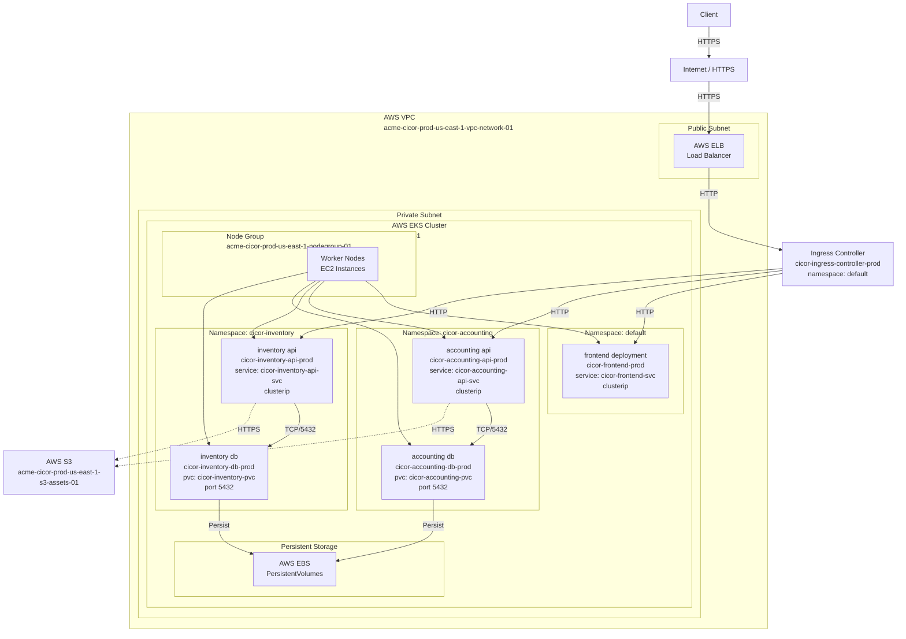

# CICOR: Plataforma de Planificación de Recursos Empresariales (ERP)

##  1. Propósito del sistema
El sistema CICOR es una plataforma de planificación de recursos empresariales (ERP) diseñada bajo una arquitectura modular y desacoplada. Su propósito central es integrar, automatizar y optimizar los procesos de negocio de la organización, garantizando la independencia operativa de sus áreas funcionales, pero permitiendo la interoperabilidad de los datos. El valor fundamental de CICOR radica en su capacidad para escalar horizontalmente de manera independiente según la demanda de cada módulo, centralizando la administración empresarial en una infraestructura en la nube resiliente, auditable y de alta disponibilidad.

## 2. Alcance de la primera versión
* Despliegue de un contenedor frontend React bajo Kubernetes sin lógica de negocio significativa, únicamente una estructura base con rutas de navegación.
* Despliegue de APIs de los módulos Contabilidad e Inventario implementadas en Python (FastAPI) como esqueletos funcionales, sin lógica de negocio compleja, solo endpoints REST básicos.
* Despliegue de bases de datos PostgreSQL contenerizadas para ambos módulos (Contabilidad e Inventario) como Pods dentro del clúster EKS.
* Creación de Namespaces segregados: `cicor-accounting` e `cicor-inventory` dentro del clúster Kubernetes.
* Definición de Deployments independientes para cada contenedor: frontend, `cicor-accounting-api-prod`, `cicor-inventory-api-prod`, `cicor-accounting-db-prod`, `cicor-inventory-db-prod`.
* Exposición de servicios mediante Services de tipo ClusterIP para comunicación interna entre Pods.
* Implementación de un Ingress Controller básico (Nginx) para enrutamiento del tráfico externo hacia el frontend.
* Provisión de almacenamiento persistente mediante PersistentVolumes y PersistentVolumeClaims para las bases de datos.
* Gestión de configuración mediante Kubernetes ConfigMaps y Secrets para variables de entorno, credenciales de base de datos y configuración de aplicaciones.
* Almacenamiento centralizado de todos los archivos de configuración (manifiestos YAML de Kubernetes, Dockerfiles, archivos `.env`) en el mismo repositorio.
* Despliegue arquitectónico funcional en AWS EKS sin implementar persistencia de datos entre ambientes, enfocado únicamente en validar la orquestación de contenedores y comunicación entre componentes.

## 3. Despliegues y tecnologías a utilizar

| Namespace | Deployment | Rol / Función | Tecnología principal | Tipo de Pod | Persistencia |
| :--- | :--- | :--- | :--- | :--- | :--- |
| `default` | `cicor-ingress-controller-prod` | Controlador de Ingress y enrutamiento de tráfico externo | Nginx Ingress | Contenedor Nginx | No |
| `default` | `cicor-frontend-prod` | Interfaz de usuario unificada del ERP | React (Node.js) | Contenedor Frontend | No |
| `cicor-commercial` | `cicor-commercial-api-prod` | Lógica de negocio y servicios REST del módulo Comercial | Python (FastAPI) | Pod API | No |
| `cicor-commercial` | `cicor-commercial-db-prod` | Almacenamiento transaccional del módulo Comercial | PostgreSQL | Pod Base de Datos | Sí |
| `cicor-inventory` | `cicor-inventory-api-prod` | Lógica de negocio y servicios REST del módulo Inventario | Python (FastAPI) | Pod API | No |
| `cicor-inventory` | `cicor-inventory-db-prod` | Almacenamiento transaccional del módulo Inventario | PostgreSQL | Pod Base de Datos | Sí |
| `cicor-accounting` | `cicor-accounting-api-prod` | Lógica de negocio y servicios REST del módulo Contabilidad | Python (FastAPI) | Pod API | No |
| `cicor-accounting` | `cicor-accounting-db-prod` | Almacenamiento transaccional del módulo Contabilidad | PostgreSQL | Pod Base de Datos | Sí |
| `cicor-operations` | `cicor-operations-api-prod` | Lógica de negocio y servicios REST del módulo Operaciones | Python (FastAPI) | Pod API | No |
| `cicor-operations` | `cicor-operations-db-prod` | Almacenamiento transaccional del módulo Operaciones | PostgreSQL | Pod Base de Datos | Sí |
| `cicor-hr` | `cicor-hr-api-prod` | Lógica de negocio y servicios REST del módulo Recursos Humanos | Python (FastAPI) | Pod API | No |
| `cicor-hr` | `cicor-hr-db-prod` | Almacenamiento transaccional del módulo Recursos Humanos | PostgreSQL | Pod Base de Datos | Sí |
| `cicor-admin` | `cicor-admin-api-prod` | Lógica de negocio y servicios REST del módulo Administración | Python (FastAPI) | Pod API | No |
| `cicor-admin` | `cicor-admin-db-prod` | Almacenamiento transaccional del módulo Administración | PostgreSQL | Pod Base de Datos | Sí |

## 4. Comunicación entre componentes
* **Tráfico externo**: Los usuarios finales acceden a través del protocolo HTTPS al Ingress Controller (`cicor-ingress-controller-prod`), que actúa como puerta de enlace única del clúster.
* **Ingress a Frontend**: El Ingress Controller enruta el tráfico HTTPS al Service `cicor-frontend-svc` (tipo ClusterIP) en el Namespace `default`, exponiendo el Pod frontend.
* **Frontend a APIs**: El frontend realiza peticiones asíncronas RESTful en formato JSON contra la Ingress, que las distribuye a los Services correspondientes según la ruta URI.
* **Comunicación intra-clúster**: Los Pods se comunican entre sí utilizando DNS interno de Kubernetes (ej. `cicor-commercial-api-svc.cicor-commercial.svc.cluster.local`) mediante peticiones HTTP sobre el puerto 80, con aislamiento garantizado por el Namespace.
* **APIs a Bases de Datos**: Cada Deployment API se comunica de forma exclusiva y directa con su Pod base de datos correspondiente (mismo Namespace) utilizando el protocolo TCP/IP sobre el puerto 5432, con credenciales inyectadas como Kubernetes Secrets.
* **Módulos a Almacenamiento Externo**: Los Pods API interactúan con el servicio AWS S3 a través de llamadas HTTPS (librería Boto3 en Python), usando permisos delegados por IAM Roles adjuntos al clúster EKS, sin requerir credenciales estáticas en el código.
* **Service Discovery**: Kubernetes proporciona DNS interno para la resolución automática de Services, eliminando la necesidad de gestión manual de direcciones IP entre Pods.

## 5. Diagrama de arquitectura

## 6. Servicios de nube y herramientas a utilizar
* AWS EKS (Elastic Kubernetes Service).
* AWS ECS (Elastic Container Service) — como alternativa secundaria para servicios no orquestables en K8s.
* Kubernetes (Deployments, Pods, Services, Namespaces, ConfigMaps, Secrets, PersistentVolumes, PersistentVolumeClaims, Network Policies, RBAC, Ingress Controller).
* Docker.
* AWS EC2 (como Worker Nodes del clúster EKS).
* AWS VPC (segmentación de red).
* Subredes Públicas y Privadas de AWS.
* AWS ELB (Elastic Load Balancing) — exposición del Ingress Controller al exterior.
* AWS Elastic IP — direccionamiento estático para NAT Gateways.
* AWS IAM (gestión de roles y políticas para acceso a S3 y otros servicios).
* AWS Secrets Manager — gestión centralizada de secretos en producción.
* AWS S3 (almacenamiento de objetos y documentos).
* AWS EBS (volúmenes persistentes para bases de datos).
* AWS Backup — copias de seguridad automatizadas de snapshots de EBS.
* AWS RDS (opcional) — alternativa administrada para bases de datos en versiones futuras.
* AWS CloudWatch — observabilidad, logs y métricas del clúster EKS.
* AWS CloudTrail — auditoría de eventos de API.
* AWS Systems Manager Parameter Store — gestión de configuración centralizada.
* Nginx Ingress Controller — enrutamiento HTTP/HTTPS y gestión de cerificados TLS.
* Kubernetes Metrics Server — recopilación de métricas para HPA (Horizontal Pod Autoscaler).
* cert-manager — gestión automática de certificados SSL/TLS.
* Otros: GitHub, GitHub Actions, VS Code, Postman, DBeaver, Terraform, Helm, kubectl.

## 7. Gestión de volúmenes y almacenamiento
* **Datos transaccionales**: La información estructurada de negocio persiste en los Pods de bases de datos PostgreSQL, respaldados por PersistentVolumeClaims (PVC) que se mapean a volúmenes EBS persistentes.
* **Archivos no estructurados**: Documentos, facturas en PDF, y recursos multimedia generados por el ERP se almacenan en AWS S3, accesibles desde cualquier Pod mediante credenciales delegadas por IAM.
* **Ambiente Local**: Se emplean volúmenes administrados por Docker (Docker named volumes) definidos en `docker-compose.yml` para garantizar la persistencia de contenedores PostgreSQL durante desarrollo local.
* **Ambiente Dev**: Se aprovisionan volúmenes AWS EBS adjuntos a los nodos del clúster EKS (`acme-cicor-dev-us-east-1-eks-cluster-01`); se definen PersistentVolumes (PV) y PersistentVolumeClaims (PVC) en Kubernetes para cada base de datos, garantizando persistencia incluso tras la eliminación del Pod.
* **Ambiente QA**: Configuración idéntica a Dev, con volúmenes EBS específicos (`acme-cicor-qa-us-east-1-eks-cluster-01`) y políticas de snapshot automáticas cada 12 horas.
* **Ambiente Prod**: Volúmenes EBS de mayor capacidad con replicación multi-zona habilitada; snapshots diarios gestionados por AWS Backup; almacenamiento mínimo de 30 días de retención.
* **Buckets S3**: Un bucket por ambiente (ej. `acme-cicor-dev-us-east-1-s3-assets-01`, `acme-cicor-prod-us-east-1-s3-assets-01`) para segregar datos y aplicar políticas de ciclo de vida independientes.
* **ConfigMaps y Secrets**: Datos de configuración no sensibles van en ConfigMaps de Kubernetes (ej. variables de entorno); credenciales, cadenas de conexión y tokens van en Kubernetes Secrets (etcd encriptado).
* **Estrategia de respaldo**: Snapshots de EBS cada 24 horas con retención de 90 días en producción; exportación diaria de dumps de bases de datos a S3 para recuperación de desastres.

## 8. Seguridad
* **Aislamiento de Namespaces**: Cada módulo del ERP reside en su propio Namespace de Kubernetes (`cicor-commercial`, `cicor-inventory`, etc.), proporcionando aislamiento lógico a nivel de RBAC y NetworkPolicy.
* **Network Policies**: Se aplican restricciones de firewall a nivel de red de Kubernetes mediante NetworkPolicies, limitando el tráfico entre Pods; solo los Pods del Ingress Controller pueden acceder a las APIs, y solo las APIs pueden acceder a sus respectivas bases de datos.
* **Control de Acceso Basado en Roles (RBAC)**: Se definen Roles y RoleBindings por Namespace, restringiendo permisos de usuario y service accounts exclusivamente a las operaciones necesarias.
* **Gestión de secretos**: Las credenciales de bases de datos (usuario, contraseña) se almacenan como Kubernetes Secrets (etcd encriptado en reposo); en producción, se integra AWS Secrets Manager para rotación automática de credenciales.
* **Service Accounts**: Cada Deployment utiliza un Service Account específico con permisos mínimos necesarios; se asignan IAM Roles a los nodos EKS que heredan los Pods para acceso a AWS S3 sin credenciales estáticas.
* **Variables de entorno**: La configuración sensible (claves de encriptación, tokens JWT, credenciales API) se inyecta en los contenedores como Kubernetes Secrets o a través de AWS Systems Manager Parameter Store.
* **Configuración segura de Ingress**: El Ingress Controller utiliza certificados TLS/SSL gestionados automáticamente por cert-manager; el tráfico entre cliente e Ingress es HTTPS, y entre Ingress e Pods es HTTP interno.
* **Exclusión de versiones de control**: Los archivos `.env` locales y configuraciones sensibles se excluyen mediante `.gitignore`; credenciales nunca se comitean al repositorio.
* **Auditoría**: AWS CloudTrail registra todas las llamadas a la API de EKS; Kubernetes Audit logs capturan acceso a recursos dentro del clúster.
* **Grupos de seguridad**: Los nodos EKS están dentro de un grupo de seguridad (`acme-cicor-prod-us-east-1-sg-eks-nodes-01`) que solo permite tráfico ingress desde el ELB en puertos 80/443 y SSH desde IPs administrativas autorizadas.

## 9. Criterios de éxito
* El clúster EKS (`acme-cicor-prod-us-east-1-eks-cluster-01`) está operativo con al menos 3 nodos de trabajo en estado `Ready`.
* Los seis módulos del ERP se ejecutan como Deployments independientes en Namespaces segregados, cada uno con al menos 2 replicas funcionando.
* Los Pods de las APIs son accesibles únicamente dentro del clúster a través de Services de tipo ClusterIP; no existe acceso directo desde internet.
* El Ingress Controller acepta tráfico HTTPS desde internet y enruta correctamente hacia el frontend y las APIs según el hostname/path.
* La comunicación entre cada Pod API y su correspondiente Pod de base de datos es funcional; los datos persisten tras la eliminación y recreación del Pod (respaldados por PVC).
* Las peticiones HTTP simuladas mediante Postman hacia el Ingress (`cicor-prod.acme.com`) son enrutadas correctamente a la API del módulo correspondiente mediante reglas de Ingress basadas en path.
* Los Pods de backend son capaces de cargar y descargar un archivo de prueba en el bucket `acme-cicor-prod-us-east-1-s3-assets-01` utilizando IAM Roles asignados a los nodos, sin emplear Access Keys estáticos.
* Las Network Policies configuradas bloquean cualquier intento de comunicación no autorizada entre Pods de diferentes Namespaces, siendo únicamente el Ingress Controller quien puede acceder a las APIs.
* Los Kubernetes Secrets (`cicor-db-credentials`, `cicor-jwt-secret`) están almacenados y encriptados; las variables de entorno no exponen credenciales en descripciones de Pods.
* El escalado automático horizontal (HPA) está configurado para cada Deployment API, permitiendo que se incremente el número de replicas cuando la utilización de CPU supera el 70%.
* Los volúmenes EBS asociados a los PersistentVolumes están configurados con snapshots automáticos diarios y con política de retención de 90 días en producción.
* Los logs de todos los Pods se capturan en CloudWatch, permitiendo buscar errores y rastrear eventos del sistema.
