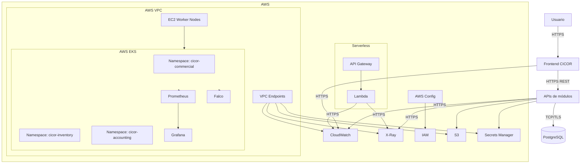

# CICOR: Documentación de Monitoreo, Observabilidad y Seguridad en AWS y Kubernetes

---

## 1. Propósito del sistema
CICOR es una plataforma ERP modular diseñada para operar sobre contenedores y servicios administrados en AWS, con despliegue en Kubernetes. Esta versión documental se enfoca en la capacidad de observar, diagnosticar, auditar y proteger la plataforma en ambientes tradicionales y serverless; garantizando visibilidad operativa, trazabilidad de cambios, cumplimiento normativo y endurecimiento de seguridad para contenedores, red, identidades y datos.

El valor del sistema radica en que cada módulo del ERP puede ser monitoreado y asegurado de manera independiente, manteniendo consistencia operativa entre ambientes y permitiendo una administración centralizada de logs, métricas, eventos, trazas y controles de seguridad.

## 2. Alcance de la segunda versión
Esta versión amplía la documentación del proyecto CICOR en tres frentes principales:
- Monitoreo y observabilidad para entornos tradicionales sobre EC2 y para servicios serverless como Lambda y API Gateway;
- Diagnóstico y configuración operativa en Kubernetes, complementado con el rastreo continuo de cambios y cumplimiento normativo mediante AWS Config;
- Seguridad en AWS y contenedores, incluyendo identidad, red, protección de datos, escaneo de vulnerabilidades y controles de runtime.

### ¿Qué incluye esta versión?
- Centralización de logs de aplicación, sistema y auditoría en Amazon CloudWatch;
- Trazabilidad distribuida con AWS X-Ray para flujos entre frontend, APIs, Lambda y servicios intermedios;
- Recolección de métricas de infraestructura y aplicaciones mediante Prometheus y visualización en Grafana;
- Diagnóstico de Pods, eventos, namespaces, reinicios y fallos de despliegue en Kubernetes;
- Evaluación continua de configuración y cambios de infraestructura con AWS Config;
- Aplicación del modelo de responsabilidad compartida para delimitar obligaciones entre AWS y el equipo del proyecto;
- Gestión de identidades y permisos con IAM, Service Accounts y RBAC;
- Seguridad de red mediante VPC, subredes privadas, endpoints y control de tráfico;
- Protección de datos en tránsito y en reposo;
- Aseguramiento de imágenes de contenedor mediante escaneo de vulnerabilidades CVE;
- Controles de runtime con Seccomp, Falco y políticas RBAC.

### ¿Qué no incluye?
- Desarrollo de lógica funcional del ERP;
- Implementación de reglas de negocio detalladas;
- Automatización avanzada de CI/CD fuera del alcance documental;
- Explicación de código fuente de aplicaciones.

## 3. Componentes y tecnologías a utilizar

| Componente | Rol / Función | Tecnología principal | Persistencia |
| :--- | :--- | :--- | :--- |
| Frontend del ERP | Interfaz de usuario para operación y consulta | React; Nginx; Docker | No |
| APIs de módulos | Exposición de servicios REST y orquestación de negocio | Python; FastAPI; Docker | No |
| Bases de datos por módulo | Persistencia transaccional de cada dominio | PostgreSQL | Sí |
| Amazon EC2 | Nodos de trabajo para entornos tradicionales | Amazon EC2 | No |
| Amazon EKS | Orquestación de contenedores | Kubernetes; AWS EKS | No |
| AWS Lambda | Procesamiento serverless y eventos | Python o Node.js | No |
| Amazon API Gateway | Puerta de entrada para APIs serverless | API Gateway | No |
| Amazon CloudWatch | Logs, métricas, alarmas y tableros operativos | CloudWatch | Sí |
| AWS X-Ray | Trazabilidad distribuida | X-Ray | No |
| Prometheus | Recolección de métricas de Kubernetes y aplicaciones | Prometheus | Sí |
| Grafana | Visualización de métricas y tableros | Grafana | Sí |
| AWS Config | Detección de cambios y cumplimiento | AWS Config | Sí |
| AWS IAM | Identidades, roles y políticas | IAM | No |
| AWS VPC | Segmentación de red | VPC | No |
| VPC Endpoints | Acceso privado a servicios administrados | VPC Endpoints | No |
| AWS S3 | Almacenamiento de objetos, evidencias y respaldos | S3 | Sí |
| AWS Secrets Manager | Gestión de secretos | Secrets Manager | Sí |
| Kubernetes RBAC | Control de acceso al clúster | RBAC | No |
| Falco | Detección de comportamiento anómalo en runtime | Falco | Sí |
| Seccomp | Restricción de llamadas al sistema | Seccomp | No |
| Otros | GitHub, GitHub Actions, VS Code, Postman, Terraform, Helm, kubectl | Herramientas locales | No |

## 4. Comunicación entre componentes
Los componentes de CICOR deben comunicarse de forma controlada y trazable, diferenciando flujos síncronos, asíncronos y de observabilidad.

- El usuario accede al frontend mediante HTTPS;
- El frontend consume APIs internas o servicios expuestos a través de Ingress o API Gateway;
- Las APIs en Kubernetes se comunican con sus bases de datos mediante TCP cifrado cuando corresponda;
- Los componentes serverless usan API Gateway y Lambda para ejecución por evento;
- Los logs se emiten en stdout y se recolectan centralmente en CloudWatch;
- Las trazas distribuidas se propagan con AWS X-Ray a través de frontend, APIs, Lambda y servicios externos;
- Las métricas de Pods, nodos y aplicaciones se exponen a Prometheus y se consumen desde Grafana;
- AWS Config recibe y compara configuraciones para detectar cambios, desviaciones y recursos no conformes;
- Falco inspecciona eventos del runtime para alertar sobre comportamientos sospechosos en contenedores.

### Protocolos principales
| Comunicación | Protocolo | Uso |
| --- | --- | --- |
| Usuario a frontend | HTTPS | Acceso seguro al sistema |
| Frontend a APIs | HTTPS; REST | Consumo de servicios |
| APIs a bases de datos | TCP; TLS | Persistencia transaccional |
| Kubernetes a CloudWatch | HTTPS | Envío de logs y métricas |
| Componentes a X-Ray | HTTPS | Trazabilidad distribuida |
| Prometheus a targets | HTTP o HTTPS | Scraping de métricas |
| AWS Config a cuenta AWS | Servicio administrado | Evaluación de configuración |

## 5. Diagrama de arquitectura

## 6. Servicios de nube y herramientas a utilizar
- Amazon EKS;
- Amazon EC2;
- AWS Lambda;
- Amazon API Gateway;
- Amazon CloudWatch;
- AWS X-Ray;
- Amazon Managed Service for Prometheus o Prometheus autogestionado;
- Grafana;
- AWS Config;
- AWS IAM;
- AWS VPC;
- VPC Endpoints;
- Amazon S3;
- AWS Secrets Manager;
- AWS Systems Manager Parameter Store;
- AWS CloudTrail;
- Kubernetes;
- Docker;
- Helm;
- kubectl;
- Terraform;
- Falco;
- Seccomp;
- RBAC;
- Nginx Ingress Controller;
- cert-manager;
- Otros: GitHub, GitHub Actions, VS Code, Postman, DBeaver.

## 7. Gestión de volúmenes y almacenamiento
- Los datos transaccionales deben persistir en PostgreSQL por módulo;
- Los logs centralizados se almacenan en CloudWatch;
- Los eventos de auditoría y configuración se retienen en AWS Config y CloudTrail;
- Los artefactos, respaldos, reportes y evidencias operativas se almacenan en S3;
- En Kubernetes, los volúmenes persistentes deben usarse únicamente para componentes que requieran almacenamiento local controlado;
- En local, se pueden usar Docker volumes para bases de datos y entornos de prueba;
- En Dev, QA y Prod, la persistencia debe separarse por ambiente y no compartir datos entre dominios;
- El almacenamiento de observabilidad no debe mezclar datos productivos con datos temporales de depuración;
- Los retenedores de logs y métricas deben alinearse con política de cumplimiento y auditoría.

## 8. Seguridad
La seguridad debe documentarse bajo el modelo de responsabilidad compartida:
- AWS protege la infraestructura física, la disponibilidad del servicio administrado y el plano base de sus servicios;
- El equipo del proyecto protege la configuración del clúster, las imágenes, los secretos, la identidad, la red y los datos de aplicación.

### Controles obligatorios
- IAM con mínimo privilegio;
- RBAC por namespace y por función;
- Service Accounts dedicados por workload;
- Network Policies para limitar tráfico entre Pods;
- Subredes privadas para workloads internos;
- VPC Endpoints para acceso privado a servicios administrados;
- Secrets Manager para credenciales y llaves sensibles;
- Cifrado en tránsito con TLS;
- Cifrado en reposo para bases de datos, S3 y secretos;
- Escaneo de imágenes por CVE antes del despliegue;
- Políticas de runtime con Seccomp y detección de comportamiento con Falco;
- AWS Config para detectar drift y recursos no conformes;
- CloudTrail para auditoría de llamadas a la cuenta AWS;
- No usar credenciales embebidas en imágenes ni en manifiestos YAML.

### Prácticas recomendadas en YAML
- Definir `resources.requests` y `resources.limits`;
- Incluir `readinessProbe` y `livenessProbe`;
- Usar `securityContext` endurecido;
- Evitar contenedores privilegiados;
- Deshabilitar escalada de privilegios;
- Fijar versiones de imágenes;
- Separar `ConfigMap` y `Secret`;
- Declarar `serviceAccountName` explícito;
- Añadir etiquetas de trazabilidad;
- Restringir exposición con `Service`, `Ingress` y `NetworkPolicy`.

## 9. Criterios de éxito
- Los logs de todos los componentes relevantes llegan a CloudWatch de forma centralizada;
- Las métricas de infraestructura y aplicación son visibles en Grafana desde Prometheus;
- AWS X-Ray permite seguir una solicitud distribuida de extremo a extremo;
- AWS Config detecta cambios de configuración y marca desviaciones de cumplimiento;
- Los Pods se ejecutan con `securityContext` endurecido y sin privilegios innecesarios;
- Las imágenes con vulnerabilidades críticas CVE son bloqueadas antes de desplegarse;
- Falco detecta eventos anómalos en runtime y genera alertas operativas;
- RBAC y IAM limitan el acceso según el principio de mínimo privilegio;
- Los secretos no se exponen en texto plano en YAML, logs ni variables visibles;
- La conectividad entre servicios usa rutas privadas y controladas;
- Los ambientes Dev, QA y Prod permanecen segregados en red, identidad y almacenamiento.
