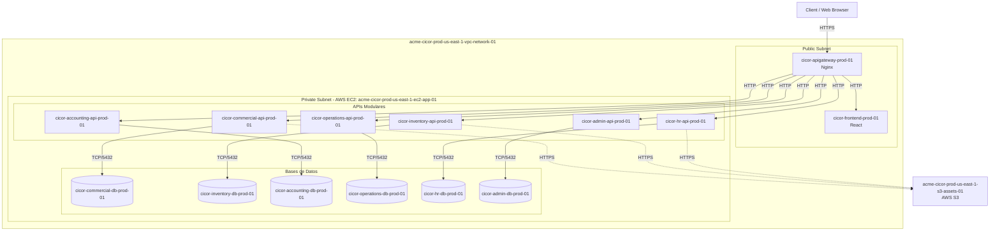

# CICOR: Plataforma de Planificación de Recursos Empresariales (ERP)

##  1. Propósito del sistema
El sistema CICOR es una plataforma de planificación de recursos empresariales (ERP) diseñada bajo una arquitectura modular y desacoplada. Su propósito central es integrar, automatizar y optimizar los procesos de negocio de la organización, garantizando la independencia operativa de sus áreas funcionales, pero permitiendo la interoperabilidad de los datos. El valor fundamental de CICOR radica en su capacidad para escalar horizontalmente de manera independiente según la demanda de cada módulo, centralizando la administración empresarial en una infraestructura en la nube resiliente, auditable y de alta disponibilidad.

## 2. Alcance de la primera versión
* Despliegue de la infraestructura base utilizando AWS VPC para la segmentación de redes (subredes públicas y privadas);
* Aprovisionamiento de instancias de cómputo virtual mediante AWS EC2 para el alojamiento de la plataforma;
* Implementación de almacenamiento de objetos estáticos y documentos mediante AWS S3;
* Orquestación y gestión del ciclo de vida de los contenedores a través de Docker y Docker Compose exclusivamente;
* Contenerización independiente de los módulos: Comercial, Inventario, Contabilidad, Operaciones, Recursos Humanos y Administración;
* Despliegue de bases de datos relacionales contenerizadas dentro de las instancias AWS EC2 para garantizar el almacenamiento persistente de cada módulo;
* Configuración de grupos de seguridad para restringir el tráfico a nivel de red y transporte.

## 3. Contenedores y tecnologías a utilizar

| Contenedor | Rol / Función | Tecnología principal | Persistencia |
| :--- | :--- | :--- | :--- |
| `cicor-apigateway-prod-01` | Puerta de enlace de API y enrutamiento inverso | Nginx | No |
| `cicor-frontend-prod-01` | Interfaz de usuario unificada del ERP | React | No |
| `cicor-commercial-api-prod-01` | Lógica de negocio y servicios REST del módulo Comercial | Python (FastAPI) | No |
| `cicor-commercial-db-prod-01` | Almacenamiento transaccional del módulo Comercial | PostgreSQL | Sí |
| `cicor-inventory-api-prod-01` | Lógica de negocio y servicios REST del módulo Inventario | Python (FastAPI) | No |
| `cicor-inventory-db-prod-01` | Almacenamiento transaccional del módulo Inventario | PostgreSQL | Sí |
| `cicor-accounting-api-prod-01` | Lógica de negocio y servicios REST del módulo Contabilidad | Python (FastAPI) | No |
| `cicor-accounting-db-prod-01` | Almacenamiento transaccional del módulo Contabilidad | PostgreSQL | Sí |
| `cicor-operations-api-prod-01` | Lógica de negocio y servicios REST del módulo Operaciones | Python (FastAPI) | No |
| `cicor-operations-db-prod-01` | Almacenamiento transaccional del módulo Operaciones | PostgreSQL | Sí |
| `cicor-hr-api-prod-01` | Lógica de negocio y servicios REST del módulo Recursos Humanos | Python (FastAPI) | No |
| `cicor-hr-db-prod-01` | Almacenamiento transaccional del módulo Recursos Humanos | PostgreSQL | Sí |
| `cicor-admin-api-prod-01` | Lógica de negocio y servicios REST del módulo Administración | Python (FastAPI) | No |
| `cicor-admin-db-prod-01` | Almacenamiento transaccional del módulo Administración | PostgreSQL | Sí |

## 4. Comunicación entre componentes
* **Cliente a Interfaz**: Los usuarios finales interactúan con el contenedor `cicor-frontend-prod-01` a través del protocolo HTTPS;
* **Frontend a Backend**: El frontend realiza peticiones asíncronas RESTful en formato JSON hacia el `cicor-apigateway-prod-01`;
* **Enrutamiento interno**: El API Gateway actúa como proxy inverso, redirigiendo las peticiones HTTP internas al contenedor API correspondiente (ej. `cicor-commercial-api-prod-01`) basándose en el path de la URI;
* **Comunicación inter-módulos**: La comunicación entre los distintos módulos del ERP se realiza de forma síncrona mediante peticiones HTTP/REST a nivel de la red privada de Docker, garantizando el desacoplamiento de la lógica de negocio;
* **Módulos a Base de Datos**: Cada API escrita en Python se comunica de forma exclusiva y directa con su propio contenedor de base de datos PostgreSQL utilizando el protocolo TCP/IP sobre el puerto 5432, previniendo el acoplamiento a nivel de datos;
* **Módulos a Almacenamiento Externo**: Las APIs interactúan con el servicio AWS S3 a través de llamadas a la API de AWS (mediante la librería Boto3 en Python) sobre HTTPS para el almacenamiento y recuperación de archivos adjuntos y documentos operativos.

# 6. Diagrama de arquitectura

# 7. Servicios de nube y herramientas a utilizar
* Docker.
* Docker Compose.
* AWS EC2.
* AWS S3.
* Amazon RDS.
* Amazon DynamoDB.
* Amazon Cognito.
* AWS IAM.
* AWS WAF.
* AWS Secrets Manager.
* Amazon API Gateway.
* Amazon SES.
* Amazon SNS/SQS.
* Amazon CloudWatch.
* AWS VPC.
* Subredes (Públicas y Privadas de AWS).
* Grupos de seguridad de AWS (Security Groups).
* WhatsApp Business API.
* Otros: GitHub, GitHub Actions, VS Code, Postman, DBeaver, Terraform.

# 8. Gestión de volúmenes y almacenamiento
* **Datos transaccionales**: La información estructurada de negocio es el activo principal que debe persistir en las bases de datos relacionales;
* **Archivos no estructurados**: Documentos, facturas en PDF, y recursos multimedia generados por el ERP deben persistir a largo plazo sin depender del ciclo de vida de los contenedores;
* **Ambiente Local**: Se emplean volúmenes administrados por Docker (Docker named volumes) definidos en el archivo `docker-compose.yml` para garantizar la persistencia de los contenedores PostgreSQL durante el desarrollo;
* **Ambiente Dev/QA**: Se aprovisionan volúmenes AWS EBS adjuntos a las instancias AWS EC2 (`acme-cicor-dev-us-east-1-ec2-app-01` y `acme-cicor-qa-us-east-1-ec2-app-01`); estos volúmenes se mapean hacia los contenedores de bases de datos garantizando persistencia en reinicios de la instancia;
* **Ambiente Prod**: Al igual que en entornos inferiores, se utilizan volúmenes AWS EBS respaldados por políticas de AWS Lifecycle Manager para la generación de snapshots diarios;
* **Almacenamiento S3**: Todos los ambientes integran un bucket S3 específico (ej. `acme-cicor-prod-us-east-1-s3-assets-01`) destinado a persistir los objetos binarios y estáticos de manera centralizada y desvinculada del cómputo.

# 9. Seguridad
* **Aislamiento de red**: Los contenedores de las APIs y las bases de datos operan estrictamente dentro de subredes privadas, siendo inaccesibles desde internet; el acceso público queda restringido exclusivamente a las subredes públicas donde residen los balanceadores o el API Gateway;
* **Grupos de seguridad**: Se aplican restricciones de firewall a nivel de instancia mediante nomenclatura estándar, como `acme-cicor-prod-us-east-1-sg-web-01` (abierto al puerto 80/443) y `acme-cicor-prod-us-east-1-sg-app-01` (comunicación exclusiva desde el SG web);
* **Gestión de secretos locales**: Para el entorno de desarrollo y la configuración base de Docker Compose se utilizan archivos `.env` excluidos del control de versiones mediante `.gitignore`;
* **Gestión de credenciales en nube**: Se evita el uso de claves de acceso estáticas (Access Keys) para la conexión a AWS S3; en su lugar, se asignan roles de AWS IAM (`acme-cicor-prod-us-east-1-iam-role-app-01`) directamente a la instancia AWS EC2, otorgando a los contenedores permisos temporales de acceso;
* **Protección de variables**: Las cadenas de conexión a las bases de datos, tokens JWT, claves de encriptación y credenciales de servicios compartidos se inyectan en los contenedores estrictamente como variables de entorno al momento del despliegue.

# 10. Criterios de éxito
* Los seis módulos de CICOR se ejecutan como contenedores Docker independientes bajo una misma red de Docker Compose sin colisiones de puertos;
* La comunicación entre el API de un módulo y su respectiva base de datos es funcional y los datos persisten exitosamente tras la eliminación y recreación del contenedor;
* Las peticiones HTTP simuladas mediante Postman hacia el `cicor-apigateway-dev-01` son enrutadas correctamente a la API del módulo correspondiente;
* Los contenedores backend son capaces de cargar y descargar un archivo de prueba en el bucket `acme-cicor-dev-us-east-1-s3-assets-01` utilizando permisos delegados por AWS IAM sin emplear credenciales estáticas en el código;
* El grupo de seguridad `acme-cicor-dev-us-east-1-sg-app-01` bloquea cualquier intento de conexión externa directa a las APIs o bases de datos por SSH o TCP, permitiendo únicamente el tráfico proveniente del origen autorizado.